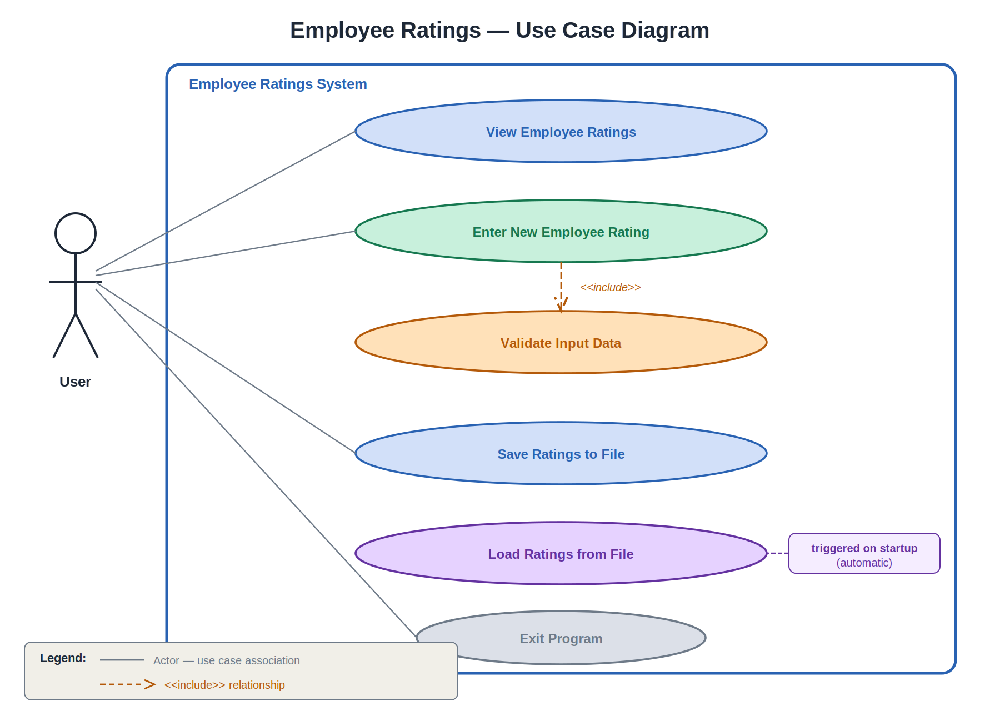
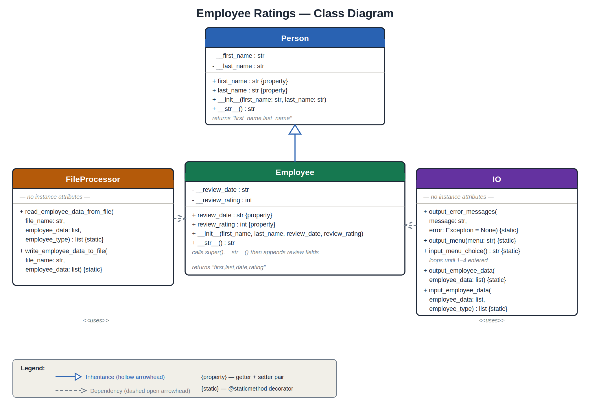
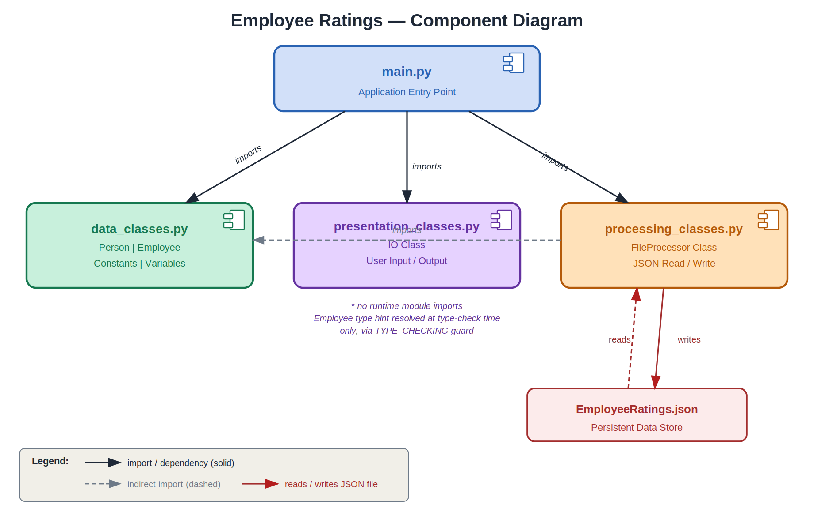
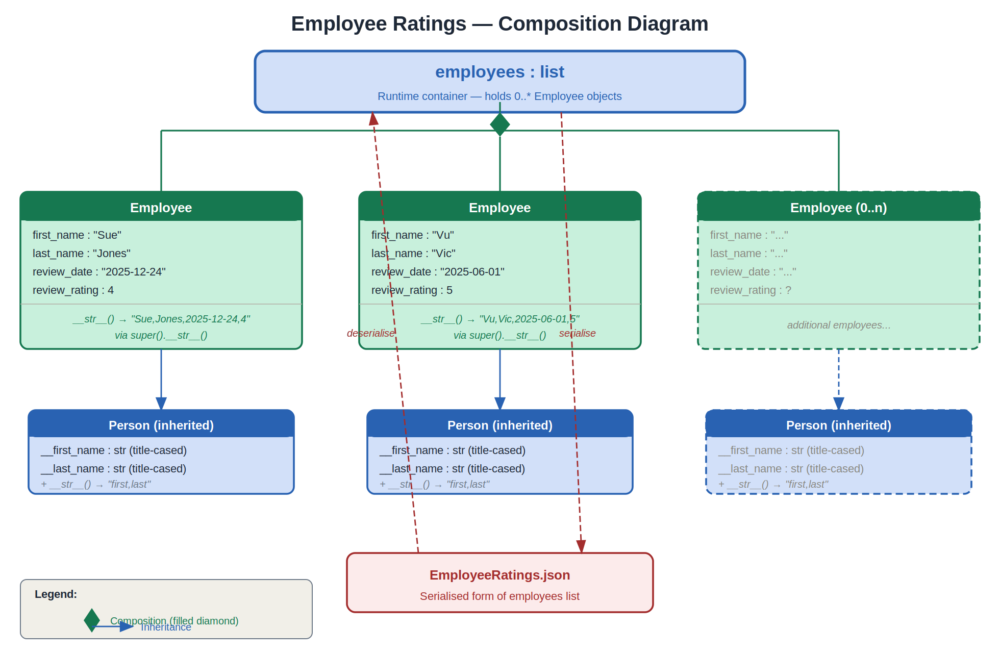

# Employee Ratings Application
 
**Date:** 2026-03-18  
**Name:** Alfredo Arnaiz

***

## Table of Contents

1. [Overview](#overview)
2. [Features](#features)
3. [File Structure](#file-structure)
4. [Architecture](#architecture)
5. [Use Case Diagram](#use-case-diagram)
6. [Class Diagram](#class-diagram)
7. [Component Diagram](#component-diagram)
8. [Composition Diagram](#composition-diagram)
9. [Classes and Modules](#classes-and-modules)
10. [Data File](#data-file)
11. [Error Handling](#error-handling)
12. [Running the Application](#running-the-application)
13. [Running the Tests](#running-the-tests)

***

## Overview

The Employee Ratings Application is a Python console program that manages employee
performance review data. It allows users to view, enter, and save employee ratings
using a layered architecture that separates data, processing, and presentation concerns.

Data is persisted to a JSON file (`EmployeeRatings.json`) which is read automatically 
on startup and written on demand. All employee records are stored in memory as a list of
`Employee` objects during the session.

***

## Features

- Load employee ratings automatically on startup from a JSON file
- Display all employee ratings with descriptive labels:
  - 5 = Leading, 
  - 4 = Strong, 
  - 3 = Solid, 
  - 2 = Building, 
  - 1 = Not Meeting Expectations
- Enter new employee ratings with full input validation
- Menu input loop forces a valid choice — invalid entries prompt a re-try rather than accepting bad input
- Save all ratings back to the JSON file
- Structured error handling throughout all layers
- Comprehensive unit test suite covering all modules (55 tests)

***

## File Structure

```
project/
├── main.py                      # Application entry point
├── data_classes.py              # Person, Employee classes + constants
├── processing_classes.py        # FileProcessor class (JSON I/O)
├── presentation_classes.py      # IO class (user input/output)
├── EmployeeRatings.json         # Persistent data store
├── test_data_classes.py         # Unit tests for data classes
├── test_processing_classes.py   # Unit tests for FileProcessor
└── test_presentation_classes.py # Unit tests for IO
```

***

## Architecture

The application follows a three-layer architecture with a dedicated entry point:

| Layer        | Module                    | Responsibility                        |
|--------------|---------------------------|---------------------------------------|
| Data         | `data_classes.py`         | Classes, constants, variables         |
| Processing   | `processing_classes.py`   | JSON file read and write operations   |
| Presentation | `presentation_classes.py` | User input, output, error display     |
| Entry Point  | `main.py`                 | Orchestrates all layers               |


***

`main.py` imports all three supporting modules. `presentation_classes.py` and `processing_classes.py` 
both import `data_classes.py` for type references. There is no circular dependency between modules.

The `if __name__ == "__main__":` guard in `main.py` ensures the application loop does not execute 
when the module is imported by the test files.

<div style="page-break-after: always;"></div>

## Use Case Diagram



The use case diagram shows how the User interacts with the system:

- **View Employee Ratings** — displays all current records
- **Enter New Employee Rating** — prompts for name, date, and rating; includes input validation
- **Save Ratings to File** — persists the in-memory list to JSON
- **Load Ratings from File** — runs automatically on startup
- **Exit Program** — terminates the application

***

<div style="page-break-after: always;"></div>

## Class Diagram



The class diagram shows four classes and their relationships:

- `Person` is the base class providing `first_name` and `last_name` with validation
- `Employee` inherits from `Person` and adds `review_date` and `review_rating`
- `FileProcessor` uses `Employee` objects when reading from and writing to JSON
- `IO` uses `Employee` objects for display and user input collection

All properties in `Person` and `Employee` use the `@property` decorator with setters
that validate input before assignment.

***

<div style="page-break-after: always;"></div>

## Component Diagram



The component diagram shows the module dependencies at runtime:

- `main.py` imports all three supporting modules
- `processing_classes.py` imports `data_classes.py` for type references
- `presentation_classes.py` has no runtime module imports, but Employee is resolved via TYPE_CHECKING
- `processing_classes.py` reads from and writes to `EmployeeRatings.json`

There is no circular dependency between modules.

***

<div style="page-break-after: always;"></div>

## Composition Diagram



The composition diagram shows the runtime object structure:

- The `employees` list is the central runtime container
- It is composed of zero or more `Employee` objects
- Each `Employee` object inherits its `first_name` and `last_name` fields from `Person`
- The entire `employees` list is serialized to `EmployeeRatings.json` on save
  and deserialized back into objects on load

***

## Classes and Modules

### `data_classes.py`

#### `Person`

Base class representing a person.

| Member         | Type     | Description                              |
|----------------|----------|------------------------------------------|
| `first_name`   | `str`    | Property; validated; title-cased         |
| `last_name`    | `str`    | Property; validated; title-cased         |
| `__str__()`    | method   | Returns `"first_name,last_name"`         |

Validation: names must be alphabetic or empty. Numbers and special characters raise `ValueError`.

#### `Employee(Person)`
Subclass adding review fields.

| Member          | Type  | Default     | Description                                    |
|-----------------|-------|-------------|------------------------------------------------|
| `review_date`   | `str` | `1900-01-01` | ISO format date; validated                     |
| `review_rating` | `int` | `3`         | Integer 1–5; validated                         |
| `__str__()`     | method| `—`         | Calls `super().__str__()` then appends review fields CSV |

`__str__()` delegates to `Person.__str__()` via `super()` to produce the full comma-separated output, avoiding field repetition.

***

### `processing_classes.py`

#### `FileProcessor`

| Method                          | Description                                      |
|---------------------------------|--------------------------------------------------|
| `read_employee_data_from_file`  | Reads JSON file; returns list of Employee objects|
| `write_employee_data_to_file`   | Writes list of Employee objects to JSON file     |

***

### `presentation_classes.py`

#### `IO`

| Method                   | Description                                                           |
|--------------------------|-----------------------------------------------------------------------|
| `output_error_messages`  | Displays user-friendly + optional technical error                     |
| `output_menu`            | Prints the menu string                                                |
| `input_menu_choice`      | `while True` loop; re-prompts on invalid input until 1–4 is entered  |
| `output_employee_data`   | Displays all employees with name, date, rating number and label; uses a `rating_descriptions` dict |
| `input_employee_data`    | Collects and validates a new employee record                          |

***

## Data File

`EmployeeRatings.json` stores employee records as a JSON array:

```json
[
  {
    "FirstName": "Sue",
    "LastName": "Jones",
    "ReviewDate": "2025-12-24",
    "ReviewRating": 4
  }
]
```

The file must exist before running the application. At minimum it should contain
an empty array `[]` or one or more valid records.

***

## Error Handling

| Scenario                        | Exception Raised     | Handler                        |
|---------------------------------|----------------------|--------------------------------|
| JSON file not found             | `FileNotFoundError`  | `output_error_messages()`      |
| Malformed JSON file             | `json.JSONDecodeError`| `output_error_messages()`      |
| Invalid JSON content            | `TypeError`           | `output_error_messages()`      |
| File write permission denied    | `PermissionError`    | `output_error_messages()`      |
| Invalid first or last name      | `ValueError`         | `output_error_messages()`      |
| Invalid review date format      | `ValueError`         | `output_error_messages()`      |
| Invalid review rating (not 1-5) | `ValueError`         | `output_error_messages()`      |


The processing layer (FileProcessor) re-raises exceptions upward. The presentation layer (IO) catches and displays them via
  output_error_messages(). main.py catches exceptions from FileProcessor and routes them to output_error_messages().

***

## Running the Application

Prerequisites:
- Python 3.7 or later
- EmployeeRatings.json must exist in the same directory as main.py

From the terminal, navigate to the project folder and run:

```bash
python main.py
```

The menu will appear:

```
---- Employee Ratings ------------------------
Select from the following menu:
    1. Show current employee rating data.
    2. Enter new employee rating data.
    3. Save data to a file.
    4. Exit the program.
----------------------------------------------
```
Menu Options:
1. Displays all employee ratings currently in memory
2. Prompts for first name, last name, review date (YYYY-MM-DD), rating (1-5)
3. Saves all records to EmployeeRatings.json
4. Exits the program
***
### Running the Tests

Run all tests at once (verbose):

```bash
python -m unittest discover -v
```

Or run individual test files:

```bash
python -m unittest test_data_classes
python -m unittest test_processing_classes
python -m unittest test_presentation_classes
```
<div style="page-break-after: always;"></div>

## Test Coverage Summary

| Test File                      | Class Tested    | Tests  |
|-------------------------------|-----------------|--------|
| `test_data_classes.py`        | Person, Employee| 24     |
| `test_processing_classes.py`  | FileProcessor   | 10     |
| `test_presentation_classes.py`| IO              | 21     |
| **Total**                     |                 | **55** |

**Note**: Some tests were generated with AI assistance and reviewed manually.